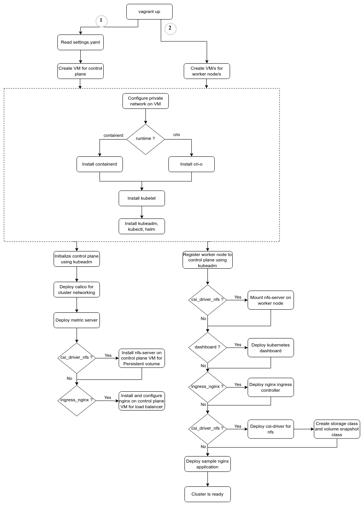

# Vagrantfile and Scripts to Automate Kubernetes Setup using Kubeadm

This is fork of [vagrant-kubeadm-kubernetes](https://github.com/techiescamp/vagrant-kubeadm-kubernetes) with some independent improvements and additional features like support for containerd runtime, csi drivers, ingress controller, etc.

## Prerequisites

1. Working Vagrant setup with VirtualBox
2. Recommended: Host (Preferrably Linux desktop) with 4 Gi+ RAM and 6+ CPUs (By default, Cluster need total 4 CPUs and 3.5Gi RAM for 1+1 nodes cluster)

## For linux users

The latest version of Virtualbox for Linux can cause issues.

Create/edit the /etc/vbox/networks.conf file and add the following to avoid any network related issues.
<pre>* 0.0.0.0/0 ::/0</pre>

or run below commands

```shell
sudo mkdir -p /etc/vbox/
echo "* 0.0.0.0/0 ::/0" | sudo tee -a /etc/vbox/networks.conf
```

So that the host only networks can be in any range, not just 192.168.56.0/21 as described here:
https://discuss.hashicorp.com/t/vagrant-2-2-18-osx-11-6-cannot-create-private-network/30984/23

## For windows users

Windows 10 and 11 fails to start VMs in headless mode. To fix this VMs (nodes) must be started in GUI mode.
Just ingore the GUIs in virtualbox window and leave it as it is after spinning.

With some older version of VirtualBox in Windows 10/11, VMs fails to start in headless mode.

To fix this, Update `gui: true` in _settings.yaml_ file. This will start the VMs in GUI mode when cluster is brought up.

## Bring Up the Cluster

To provision the cluster, execute the following commands.

```shell
git clone https://github.com/navilg/vagrant-kubernetes.git
cd vagrant-kubernetes
vagrant up
```
## Set Kubeconfig file variable

```shell
cd vagrant-kubernetes
export KUBECONFIG=$PWD/configs/config
```

or you can copy the config file to .kube directory.

```shell
cp configs/config ~/.kube/
```

## Install Kubernetes Dashboard

The dashboard is not installed by default, but it can be installed by uncommenting the dashboard version in _settings.yaml_ before running `vagrant up`.

You can deploy it later by enabling it in _settings.yaml_ and running the following:

```shell
vagrant ssh -c "/vagrant/scripts/dashboard.sh" master
```

## Kubernetes Dashboard Access

To get the login token, copy it from _config/token_ or run the following command:
```shell
kubectl -n kubernetes-dashboard get secret/admin-user -o go-template="{{.data.token | base64decode}}"
```

Proxy the dashboard:
```shell
kubectl proxy
```

Open the site in your browser:
```shell
http://localhost:8001/api/v1/namespaces/kubernetes-dashboard/services/https:kubernetes-dashboard:/proxy/#/overview?namespace=kubernetes-dashboard
```

## To shutdown the cluster,

```shell
vagrant halt
```

## To start the cluster,

```shell
vagrant up
```

## To destroy the cluster,

```shell
vagrant destroy -f
```

## Bootstrapping Flowchart

